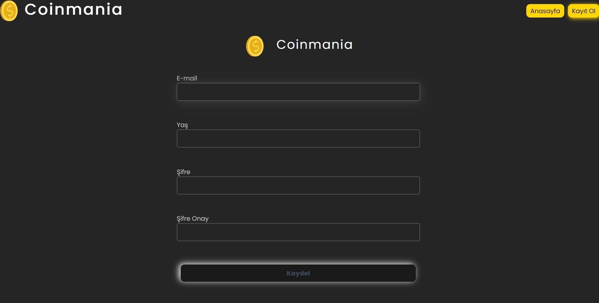

# React_Coinmania_MVCApp

CoinMania is a cryptocurrency tracking web application built using React, Redux, and the CoinCap API 2.0, following the Model-View-Controller (MVC) principle. It allows users to monitor real-time prices, market capitalizations, and other metrics of various cryptocurrencies. Users can also access historical price data and analyze trends over time.

# Tools and Libraries Used

- axios
- bootstrap
- chart.js
- formik
- millify
- react
- react-chartjs-2
- react-dom
- react-icons
- react-router-dom
- sass
- uuid
- yup

# API

- https://docs.coincap.io/

# Screenshots

## Gif

